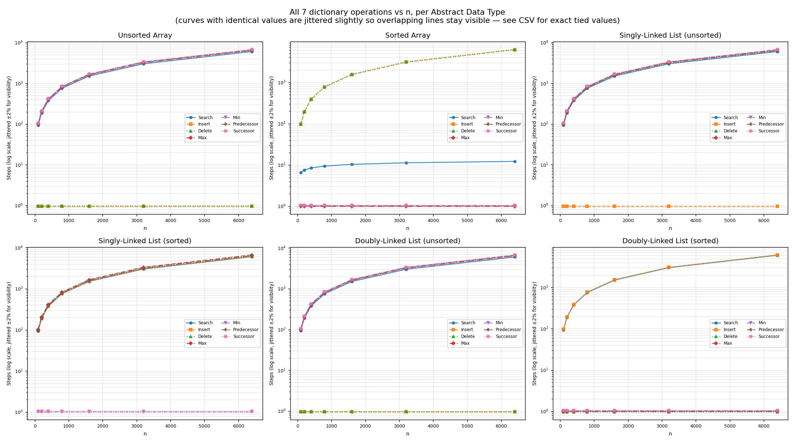
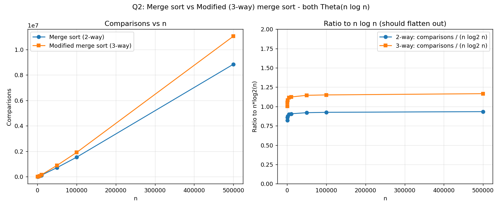
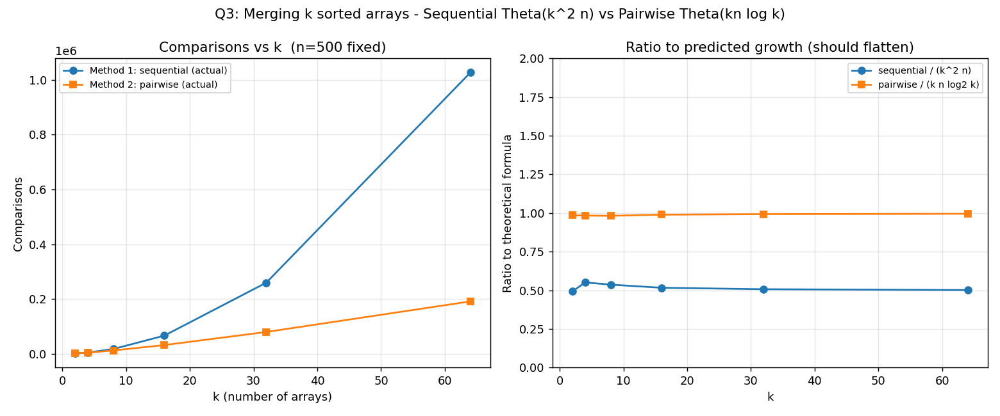

# Design and Analysis of Algorithms — Lab 02

C implementations and empirical comparisons for three fundamental algorithm and data-structure exercises.

## Contents

| Question | Topic | Source | Results |
| --- | --- | --- | --- |
| 1 | Dictionary operations using arrays and linked lists | [Dictionary_Operation.c](1.Dictionary_Operation/Dictionary_Operation.c) | [CSV](1.Dictionary_Operation/dict_ops.csv) · [plot](1.Dictionary_Operation/dict_ops.png) |
| 2 | Two-way merge sort versus three-way merge sort | [Merge_sort_vs_Modified_Merge_sort.c](2.Merge_sort_vs_Modified_Merge_sort/Merge_sort_vs_Modified_Merge_sort.c) | [CSV](2.Merge_sort_vs_Modified_Merge_sort/mergesort_data.csv) · [plot](2.Merge_sort_vs_Modified_Merge_sort/mergesort_compare.png) |
| 3 | Merging \(k\) sorted arrays | [Merging_k_Sorted_Arrays.c](3.Merging_k_Sorted_Arrays/Merging_k_Sorted_Arrays.c) | [CSV](3.Merging_k_Sorted_Arrays/kmerge_data.csv) · [plot](3.Merging_k_Sorted_Arrays/kmerge_compare.png) |

## Requirements and execution

A C compiler such as GCC or Clang is required. Run each program from its own directory so that its generated CSV is saved beside the source file.

```bash
# Question 1
cd 1.Dictionary_Operation
cc -std=c11 -Wall -Wextra -O2 Dictionary_Operation.c -o Dictionary_Operation
./Dictionary_Operation

# Question 2
cd ../2.Merge_sort_vs_Modified_Merge_sort
cc -std=c11 -Wall -Wextra -O2 Merge_sort_vs_Modified_Merge_sort.c -o Merge_sort_vs_Modified_Merge_sort
./Merge_sort_vs_Modified_Merge_sort

# Question 3
cd ../3.Merging_k_Sorted_Arrays
cc -std=c11 -Wall -Wextra -O2 Merging_k_Sorted_Arrays.c -o Merging_k_Sorted_Arrays
./Merging_k_Sorted_Arrays
```

> **Note:** Question 1 writes a newly generated file named `dict_data.csv`. The checked-in measurement file is named [`dict_ops.csv`](1.Dictionary_Operation/dict_ops.csv).

---

## 1. Dictionary operations

The program compares the worst-case cost of seven dictionary operations across six implementations:

- Unsorted array
- Sorted array
- Unsorted singly linked list (SLL)
- Sorted singly linked list (SLL)
- Unsorted doubly linked list (DLL)
- Sorted doubly linked list (DLL)

The operations are **search**, **insert**, **delete**, **maximum**, **minimum**, **predecessor**, and **successor**. Deletion is evaluated when a direct reference to the item is available. For an SLL, the predecessor must still be found before unlinking a non-head node.

| Structure | Search | Insert | Delete | Max | Min | Predecessor | Successor |
| --- | --- | --- | --- | --- | --- | --- | --- |
| Unsorted array | \(O(n)\) | \(O(1)\) | \(O(1)\) | \(O(n)\) | \(O(n)\) | \(O(n)\) | \(O(n)\) |
| Sorted array | \(O(\log n)\) | \(O(n)\) | \(O(n)\) | \(O(1)\) | \(O(1)\) | \(O(1)\) | \(O(1)\) |
| Unsorted SLL | \(O(n)\) | \(O(1)\) | \(O(n)\) | \(O(n)\) | \(O(n)\) | \(O(n)\) | \(O(n)\) |
| Sorted SLL | \(O(n)\) | \(O(n)\) | \(O(n)\) | \(O(n)\) | \(O(1)\) | \(O(n)\) | \(O(1)\) |
| Unsorted DLL | \(O(n)\) | \(O(1)\) | \(O(1)\) | \(O(n)\) | \(O(n)\) | \(O(n)\) | \(O(n)\) |
| Sorted DLL | \(O(n)\) | \(O(n)\) | \(O(1)\) | \(O(1)\) | \(O(1)\) | \(O(1)\) | \(O(1)\) |



---

## 2. Merge sort vs. modified three-way merge sort

Two algorithms are implemented and instrumented to count comparisons:

- **Standard merge sort:** divides input into two halves and performs a two-way merge.
- **Modified merge sort:** divides input into three parts and performs a three-way merge.

For standard merge sort:

\[
T_2(n) = 2T_2(n/2) + \Theta(n) = \Theta(n\log_2 n)
\]

For three-way merge sort:

\[
T_3(n) = 3T_3(n/3) + \Theta(n) = \Theta(n\log_3 n) = \Theta(n\log n)
\]

Thus, both have asymptotically the same \(\Theta(n\log n)\) running time. Their observed comparison counts differ because of their split depth and merge constants.



---

## 3. Merging \(k\) sorted arrays

Given \(k\) sorted arrays, each containing \(n\) elements, the goal is to produce one sorted array of \(kn\) elements. The program compares these two approaches and records their comparison counts.

### Method 1 — sequential merging

Merge the first two arrays, merge that result with the third array, then continue until the \(k\)-th array.

The merge costs are:

\[
2n, 3n, 4n, \ldots, kn
\]

Therefore, the worst-case running time is:

\[
T_1(n,k) = n(2 + 3 + \cdots + k)
= n\left(\frac{k(k+1)}{2} - 1\right)
= \boxed{\Theta(nk^2)}
\]

### Method 2 — pairwise (tournament) merging

Merge adjacent arrays in pairs. Repeat the pairing process on the resulting arrays until only one remains.

For \(k\) a power of two, there are \(\log_2 k\) rounds. Every round processes a total of \(kn\) elements, so:

\[
T_2(n,k) = kn\log_2 k = \boxed{\Theta(nk\log k)}
\]

If \(k\) is not a power of two, the unpaired array is carried to the next round; the asymptotic running time remains \(\Theta(nk\log k)\).

| Method | Worst-case running time | Main observation |
| --- | --- | --- |
| Sequential merging | \(\Theta(nk^2)\) | The growing partial result is scanned again for each new array. |
| Pairwise merging | \(\Theta(nk\log k)\) | Every element participates in at most one merge per round. |



## Results

The experimental plots and CSV files support the expected trends:

- Sorted arrays allow binary search, while linked-list searches remain linear.
- Both two-way and three-way merge sort follow \(\Theta(n\log n)\) growth.
- Pairwise merging scales substantially better than sequential merging as \(k\) grows.
