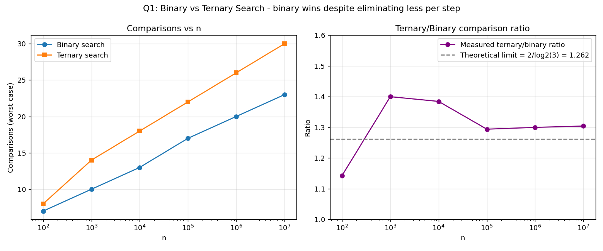
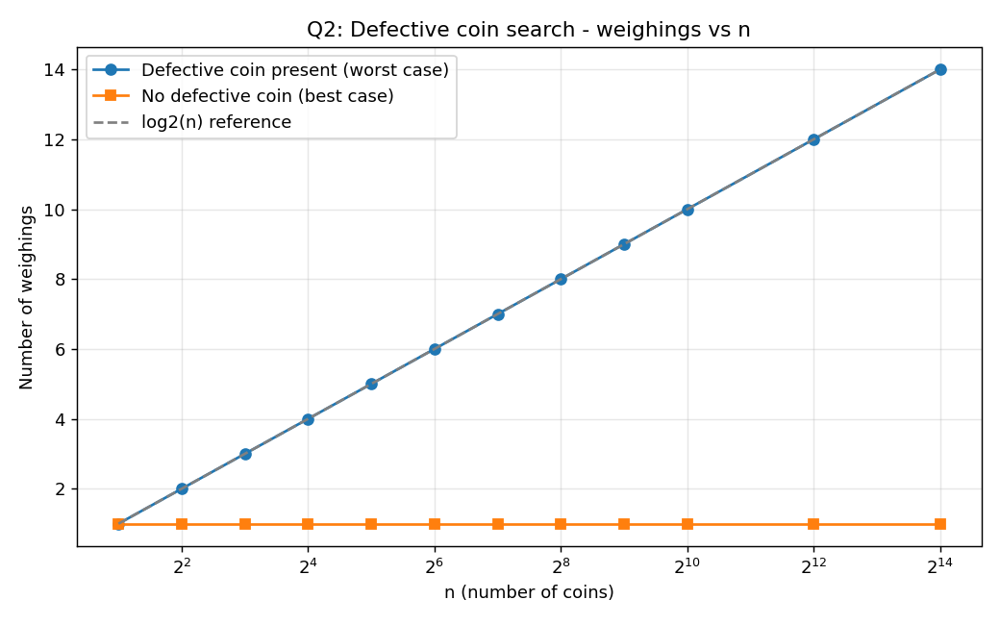
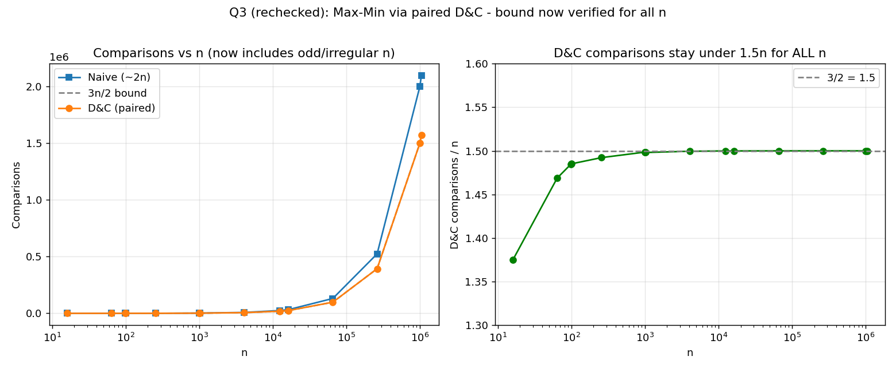
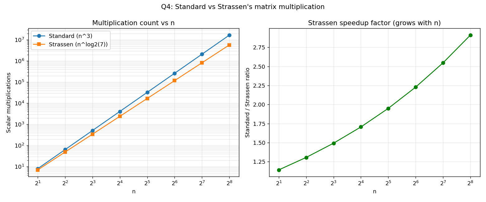
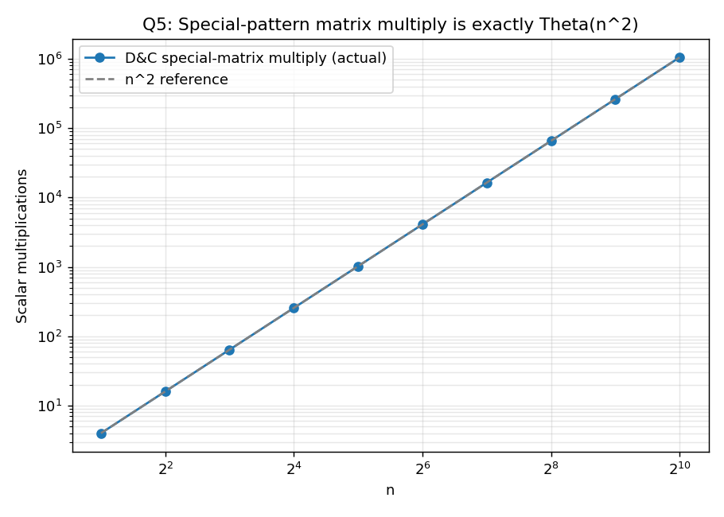
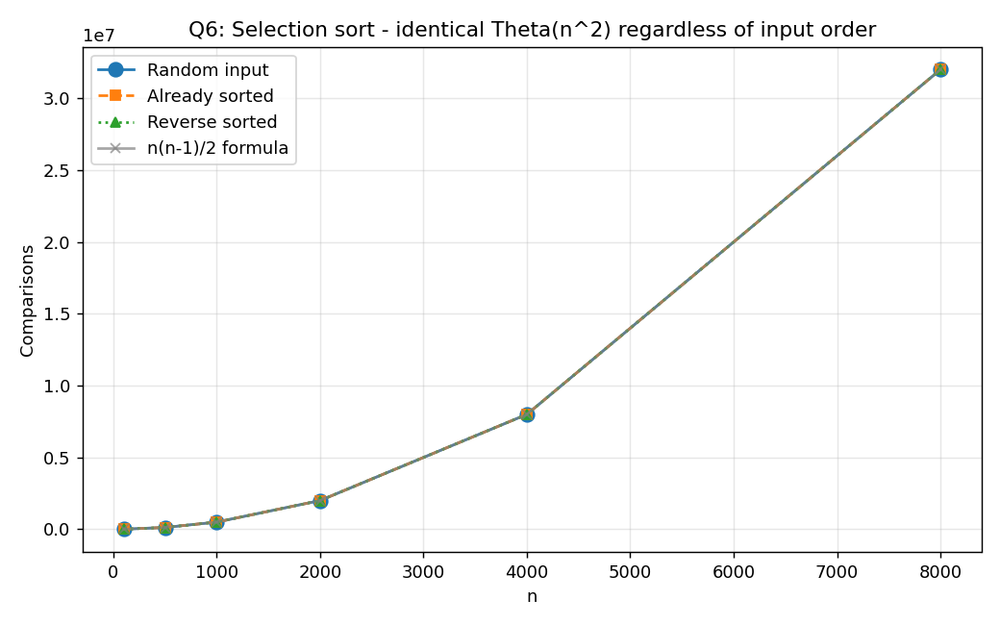

# Design and Analysis of Algorithms — Lab 03

C implementations and empirical comparisons for six divide-and-conquer exercises.

## Contents

| Question | Topic | Source | Results |
| --- | --- | --- | --- |
| 1 | Binary search vs. ternary search | [Binary_vs_Ternary_Search.c](1.Binary_vs_Ternary_Search/Binary_vs_Ternary_Search.c) | [CSV](1.Binary_vs_Ternary_Search/Binary_vs_Ternary_Search.csv) · [plot](1.Binary_vs_Ternary_Search/Binary_vs_Ternary_Search.png) |
| 2 | Searching for the defective coin | [Search_the_Defective_Coin.c](2.Search_the_Defective_Coin/Search_the_Defective_Coin.c) | [CSV](2.Search_the_Defective_Coin/Search_the_Defective_Coin.csv) · [plot](2.Search_the_Defective_Coin/Search_the_Defective_Coin.png) |
| 3 | Maximum and minimum using divide-and-conquer | [Max_and_Min_using_D&C_Approach.c](3.Max_and_Min_using_D&C_Approach/Max_and_Min_using_DandC_Approach.c) | [CSV](3.Max_and_Min_using_D&C_Approach/Max_and_Min_using_DandC_Approach.csv) · [plot](3.Max_and_Min_using_D&C_Approach/Max_and_Min_using_DandC_Approach.png) |
| 4 | Matrix multiplication using divide-and-conquer (Strassen's algorithm) | [Matrix_multiplication_using_D&c_Approach.c](4.Matrix_multiplication_using_D&c_Approach/Matrix_multiplication_using_DandC_Approach.c) | [CSV](4.Matrix_multiplication_using_D&c_Approach/Matrix_multiplication_using_DandC_Approach.csv) · [plot](4.Matrix_multiplication_using_D&c_Approach/Matrix_multiplication_using_DandC_Approach.png) |
| 5 | Multiplying a special-pattern square matrix using divide-and-conquer | [Multiply_special_pattern_square_matrix_using_D&C_Approach.c](5.Multiply_special_pattern_square_matrix_using_D&C_Approach/Multiply_special_pattern_square_matrix_using_DandC_Approach.c) | [CSV](5.Multiply_special_pattern_square_matrix_using_D&C_Approach/Multiply_special_pattern_square_matrix_using_DandC_Approach.csv) · [plot](5.Multiply_special_pattern_square_matrix_using_D&C_Approach/Multiply_special_pattern_square_matrix_using_DandC_Approach.png) |
| 6 | Loop invariants in selection sort | [Use_of_loop_invariants_in_sorting.c](6.Use_of_loop_invariants_in_sorting/Use_of_loop_invariants_in_sorting.c) | [CSV](6.Use_of_loop_invariants_in_sorting/Use_of_loop_invariants_in_sorting.csv) · [plot](6.Use_of_loop_invariants_in_sorting/Use_of_loop_invariants_in_sorting.png) |

## Requirements and execution

A C compiler such as GCC or Clang is required. Run each program from its own directory so that its generated CSV is saved beside the source file.

```bash
# Question 1
cd 1.Binary_vs_Ternary_Search
cc -std=c11 -Wall -Wextra -O2 Binary_vs_Ternary_Search.c -o Binary_vs_Ternary_Search
./Binary_vs_Ternary_Search

# Question 2
cd ../2.Search_the_Defective_Coin
cc -std=c11 -Wall -Wextra -O2 Search_the_Defective_Coin.c -o Search_the_Defective_Coin
./Search_the_Defective_Coin

# Question 3
cd "../3.Max_and_Min_using_D&C_Approach"
cc -std=c11 -Wall -Wextra -O2 Max_and_Min_using_DandC_Approach.c -o Max_and_Min_using_DandC_Approach
./Max_and_Min_using_DandC_Approach

# Question 4
cd "../4.Matrix_multiplication_using_D&c_Approach"
cc -std=c11 -Wall -Wextra -O2 Matrix_multiplication_using_DandC_Approach.c -o Matrix_multiplication_using_DandC_Approach
./Matrix_multiplication_using_DandC_Approach

# Question 5
cd "../5.Multiply_special_pattern_square_matrix_using_D&C_Approach"
cc -std=c11 -Wall -Wextra -O2 Multiply_special_pattern_square_matrix_using_DandC_Approach.c -o Multiply_special_pattern_square_matrix_using_DandC_Approach
./Multiply_special_pattern_square_matrix_using_DandC_Approach

# Question 6
cd ../6.Use_of_loop_invariants_in_sorting
cc -std=c11 -Wall -Wextra -O2 Use_of_loop_invariants_in_sorting.c -o Use_of_loop_invariants_in_sorting
./Use_of_loop_invariants_in_sorting
```

> **Note:** Folder and file names containing `&` must be quoted (as shown above) when navigating with `cd` in most shells.

---

## 1. Binary search vs. ternary search

Both algorithms locate a target in a sorted array by repeatedly narrowing the search range, but they split it differently:

- **Binary search** splits the range into 2 parts using 1 comparison per level, giving
  \[
  T(n) = T(n/2) + O(1) = \Theta(\log_2 n)
  \]
- **Ternary search** splits the range into 3 parts but needs up to 2 comparisons per level, giving
  \[
  T(n) = T(n/3) + O(1) = \Theta(2\log_3 n) = \Theta(\log_2 n)
  \]

Both are \(\Theta(\log n)\), but ternary search does **more comparisons in practice** because \(2\log_3 n > \log_2 n\) for all \(n > 1\) — halving the range once is more efficient than splitting it into thirds at the cost of an extra comparison.



---

## 2. Search the defective coin

Given `n` coins with one heavier or lighter "defective" coin, the program recursively splits the coins into two halves and weighs them against each other on a balance scale:

- If the pans balance, there is no defective coin in that half (used here as a "no defect" baseline case).
- If they don't balance, the heavier/lighter side is recursed into.

Each weighing eliminates half the candidates, so the number of weighings needed is

\[
T(n) = T(n/2) + O(1) = \Theta(\log_2 n)
\]

matching the classic balance-puzzle result of \(\lceil \log_2 n \rceil\) weighings in the worst case.



---

## 3. Maximum and minimum using divide-and-conquer

Two approaches are compared for finding both the max and min of an array:

- **Naive approach:** scan the array once for the max and once for the min (or track both in a single pass with 2 comparisons per element) — **2(n − 1)** comparisons.
- **Divide-and-conquer (paired) approach:** process elements in pairs — 1 comparison to order each pair, then 2 comparisons to update the running max/min — giving

\[
T(n) = \left\lceil \frac{3n}{2} \right\rceil - 2 = \Theta(n)
\]

Both approaches are linear, \(\Theta(n)\), but the paired approach uses roughly **25% fewer comparisons**, matching the well-known \(3n/2\) tight bound for simultaneous max/min.



---

## 4. Matrix multiplication using divide-and-conquer (Strassen's algorithm)

Two \(n \times n\) matrix multiplication algorithms are compared by counting scalar multiplications:

- **Standard (triple-loop) multiplication:**
  \[
  T(n) = \Theta(n^3)
  \]
- **Strassen's algorithm:** recursively splits each matrix into four \(n/2 \times n/2\) submatrices and combines them using only **7** submatrix multiplications instead of 8, giving
  \[
  T(n) = 7T(n/2) + \Theta(n^2) = \Theta(n^{\log_2 7}) \approx \Theta(n^{2.81})
  \]

Strassen's algorithm does asymptotically fewer multiplications than the standard method, and the gap widens as \(n\) grows — though in practice the crossover point where it pays off is larger than it appears here due to the overhead of the extra additions/subtractions.



---

## 5. Multiplying a special-pattern square matrix

Instead of multiplying two full \(n \times n\) matrices, this problem exploits a special structure — each matrix is defined by a single length-\(n\) generator array where entry \((i, j) = \text{gen}[i \oplus j]\) — to multiply using only the generator arrays.

- **Divide-and-conquer approach:** splits each generator array in half and combines **4** recursive half-size multiplications, giving
  \[
  T(n) = 4T(n/2) + \Theta(n) = \Theta(n^2)
  \]
- **Standard approach:** expands both generators into full \(n \times n\) matrices first and multiplies them directly in \(\Theta(n^3)\).

By working directly with the compact generator representation instead of materializing the full matrices, the divide-and-conquer method avoids the cubic blowup entirely.



---

## 6. Loop invariants in sorting

Selection sort is analyzed via its loop invariant: **before each iteration `i`, the subarray `A[0..i-1]` contains the `i` smallest elements of the array, in sorted order.** This invariant is verified by checking that the array is fully sorted after the algorithm terminates.

The program counts comparisons on **random**, **already-sorted**, and **reverse-sorted** input and checks the count against the closed-form formula

\[
\frac{n(n-1)}{2} = \Theta(n^2)
\]

Because selection sort always scans the remaining unsorted portion to find the minimum regardless of input order, the comparison count is **identical across all three input distributions** — unlike algorithms such as bubble sort or insertion sort, selection sort has no best-case speedup; it is \(\Theta(n^2)\) in every case.



## Results

The experimental plots and CSV files support the expected trends:

- Binary search consistently uses fewer comparisons than ternary search despite both being \(\Theta(\log n)\).
- The defective-coin search matches the \(\lceil \log_2 n \rceil\)-weighing theoretical bound.
- Paired max/min finding beats the naive method by the predicted \(3n/2\) vs \(2n\) margin.
- Strassen's algorithm's multiplication count grows more slowly than the standard \(\Theta(n^3)\) method as \(n\) increases.
- Exploiting the special matrix pattern reduces multiplication from \(\Theta(n^3)\) to \(\Theta(n^2)\).
- Selection sort's comparison count is invariant to input order, confirming its \(\Theta(n^2)\) behavior in all cases.
